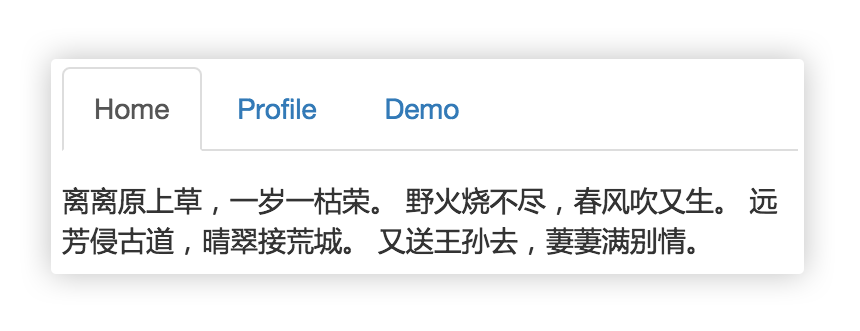

# Tab 选项卡组件



## 阶段 1

实现上图 JS 效果，CSS样式随意。

## 阶段 2

```js
tab({
    element: '.newtab',
    triggers: '.triggers',
    contents '.contents'
})
```

```html
<div class="newtab">
    <span class="triggers">1</span>
    <span class="triggers">2</span>
    <span class="triggers">3</span>
    
    <div class="contents">a</div>
    <div class="contents">b</div>
    <div class="contents">c</div>
</div>
```

可通过参数指定父级DOM、触发DOM、内容DOM。

## 阶段 3

triggers被选中时的class,默认 `active`

```js
tab({
    activeTriggerClass: 'active'
});
```

